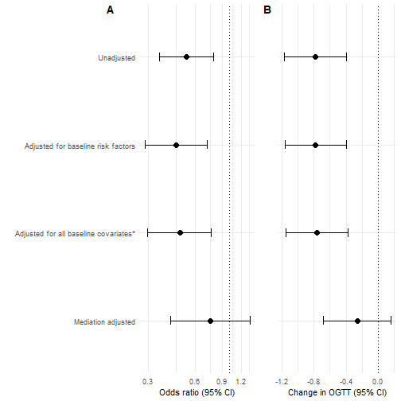
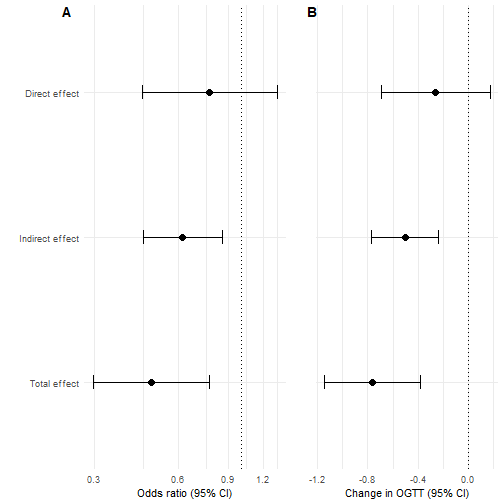
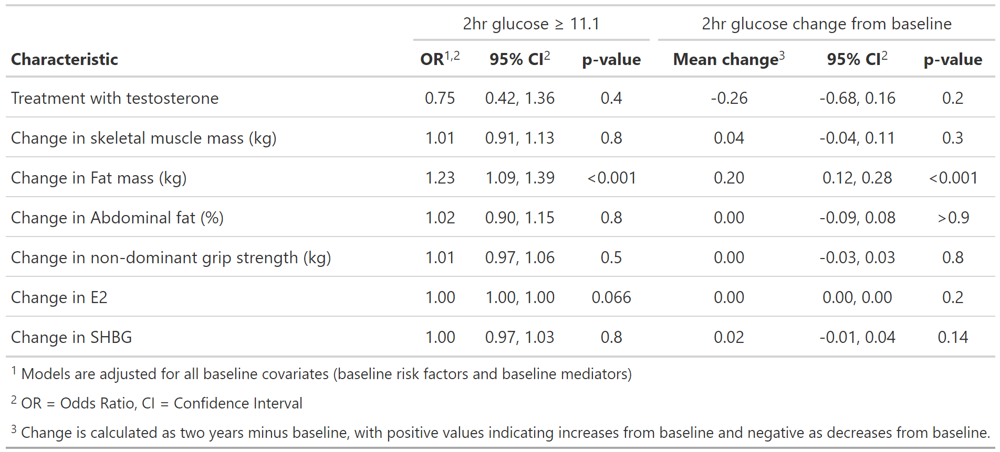

```r
knitr::opts_chunk$set(
  echo = TRUE,
  comment = "#>",
  out.width = "100%")

## read in packages

library(knitr)
library(officedown)
library(officer)
library(gtsummary)
library(flextable)
library(tidyverse)
library(janitor)
library(haven)
library(labelled)
library(glue)
library(cowplot)
library(medflex)

## dataset of all variables used in paper
df<-readRDS("mediationdf.rds")


#knit(input="mediation_paper.rmd", output = "readme.md") 
```
# T4DM mediation analyses

This is the code that performs the analyses in the paper published here (insert link when known). 


# T4DM data structure

## Outcomes at two years

- categorical outcome of diabetes `ogtt_gt11` (`1`=diabetes, `0`=no diabetes) 
- continuous outcome of change in 2hour glucose by OGTT `change_ogtt` (year 2 minus baseline)

## Baseline covariates

As included in adjusted analysis in original paper ([Wittert et al 2021](https://doi.org/10.1016/S2213-8587(20)30367-3)):

- `ogtt_base`: 2hour glucose at baseline
- `siteid`: study site
- `waist_gp`: waist circumference stratification variable (`1`=95–100 cm, `2`=101–115 cm, `3`>115 cm )
- `age_ge60`: age stratification variable, age greater than or equal to 60 (`1`=yes, `0`=no)
- `dm_hist`: first-degree family history of type 2 diabetes (`1`=yes, `0`=no)
- `ssri_base`: SSRI use at baseline (`1`=yes, `0`=no)
- `t_gp`: grouped as `1`= Low (<8.0 nmol/L), `2`=Medium (8.0 to <11.0 nmol/L), `3`= High (>=11.0 nmol/L)
- `smoker`: current smoker (`1`=yes, `0`=no)

plus 

- `treatment`: with testosterone `1`=Testosterone, `0`=placebo

## Baseline mediators

- `bmleanms_base`: baseline lean mass
- `bmfatms_base`: baseline fat mass
- `bmapfm_base`: baseline abdominal fat percentage
- `grip_base`: baseline grip strength
- `e2_base`: baseline E2
- `shbg_base`: baseline SHBG

## Mediators

- `leanmass_change`: change in lean mass
- `fatmass_change`: change in fat mass
- `abdomfat_change`: change in abdominal fat percentage
- `grip_change`: change in grip strength
- `e2_change`: change in E2
- `shbg_change`: change in SHBG

So, the dataset looks like so, using the first 2 patients as an example:


```r
df %>%
  glimpse()
```

```
#> Rows: 709
#> Columns: 24
#> $ siteid          <fct> 61219, 61219, 61219, 61512, 61512, 61512, 61219, 61512, 61617, 61512, 61617, 61617, 615~
#> $ waist_gp        <fct> 3, 3, 3, 3, 2, 3, 2, 2, 2, 2, 2, 3, 2, 2, 2, 3, 2, 3, 1, 2, 2, 3, 2, 2, 3, 3, 2, 3, 2, ~
#> $ age_ge60        <fct> 1, 1, 0, 1, 1, 1, 1, 1, 0, 1, 0, 1, 0, 1, 0, 0, 1, 0, 0, 1, 0, 0, 1, 1, 1, 0, 0, 0, 1, ~
#> $ dm_hist         <fct> 0, 0, 0, 0, 0, 1, 0, 1, 1, 0, 1, 0, 1, 1, 1, 1, 1, 0, 1, 0, 1, 0, 1, 1, 0, 1, 1, 0, 0, ~
#> $ ssri_base       <fct> 0, 0, 0, 0, 0, 0, 0, 0, 0, 0, 0, 0, 0, 0, 0, 0, 0, 0, 0, 0, 0, 0, 0, 0, 0, 0, 0, 0, 0, ~
#> $ t_gp            <fct> 3, 3, 3, 3, 3, 3, 3, 3, 3, 3, 3, 1, 3, 3, 3, 3, 3, 3, 2, 3, 3, 3, 2, 2, 3, 2, 2, 3, 3, ~
#> $ smoker          <fct> 0, 0, 0, 1, 0, 0, 0, 0, 0, 0, 0, 0, 0, 0, 0, 0, 0, 0, 0, 0, 0, 0, 0, 0, 0, 0, 0, 0, 0, ~
#> $ ogtt_gt11       <dbl> 0, 0, 0, 0, 0, 0, 0, 0, 0, 0, 0, 0, 0, 0, 1, 0, 0, 0, 0, 0, 0, 0, 0, 0, 0, 0, 0, 0, 0, ~
#> $ ogtt_base       <dbl> 8.8, 10.8, 8.9, 9.9, 9.2, 8.1, 9.4, 8.2, 8.4, 8.8, 8.9, 7.8, 8.0, 8.5, 10.5, 8.6, 7.9, ~
#> $ treat           <dbl> 1, 0, 1, 1, 1, 0, 0, 1, 0, 0, 0, 1, 0, 0, 1, 1, 1, 1, 1, 0, 1, 1, 1, 1, 0, 1, 1, 0, 1, ~
#> $ bmleanms_base   <dbl> 61760, 69431, 61898, 71298, 62130, 66217, 60528, 53883, 76806, 56635, 70712, 75360, 544~
#> $ leanmass_change <dbl> 0.992, 1.926, 3.900, -4.202, 1.022, -4.930, -2.198, 2.229, 0.700, -1.822, 2.081, 0.196,~
#> $ bmfatms_base    <dbl> 36217, 44372, 32206, 35049, 39414, 37077, 35298, 27032, 31198, 40041, 36188, 41185, 394~
#> $ fatmass_change  <dbl> -3.181, -2.434, -2.990, -9.819, -10.038, -9.755, 0.559, -5.975, 2.158, -8.293, -2.361, ~
#> $ bmapfm_base     <dbl> 46.0, 47.5, 41.0, 41.3, 49.8, 45.9, 44.3, 44.8, 36.0, 52.2, 42.2, 43.4, 54.4, 44.5, 39.~
#> $ abdomfat_change <dbl> -2.3, -2.9, -1.3, -10.6, -8.2, -8.2, -1.1, -5.4, 1.0, -4.1, -0.2, -4.4, 1.7, 2.4, -2.6,~
#> $ grip_base       <dbl> 39, 45, 52, 40, 36, 34, 41, 35, 37, 22, 68, 58, 25, 45, 45, 26, 45, 43, 49, 40, 36, 51,~
#> $ grip_change     <dbl> -1.0, 0.0, 6.0, 1.0, 10.0, -0.7, 2.0, 1.0, 18.0, 6.0, -23.0, -4.0, 7.6, 2.0, 7.0, 13.0,~
#> $ e2_base         <dbl> 210.864, 249.136, 141.312, 226.320, 379.040, 290.352, 160.448, 137.264, 178.848, 184.73~
#> $ e2_change       <dbl> 49.3120, 68.0800, 177.7440, -105.6160, -135.4240, 50.7840, 277.4720, 128.8000, 7.3600, ~
#> $ shbg_base       <dbl> 57.72, 46.25, 33.86, 34.70, 29.82, 49.53, 28.81, 36.96, 42.38, 66.24, 43.78, 20.11, 45.~
#> $ shbg_change     <dbl> 5.62, -2.81, -11.53, 5.00, 18.45, 36.41, 16.69, 11.71, 2.03, 23.57, -0.12, -1.33, -3.50~
#> $ change_ogtt     <dbl> -1.2, -1.6, -2.3, -3.5, -2.9, -2.0, -0.3, -1.3, 1.8, 0.0, -0.3, 0.1, -0.2, 2.2, 1.0, 1.~
#> $ treatment       <chr> "Testosterone", "Placebo", "Testosterone", "Testosterone", "Testosterone", "Placebo", "~
```

# Figure 2: unadjusted and adjusted analyses


```r
unadj.or<- glm(ogtt_gt11 ~treatment, data=df,
             family = binomial(link="logit")) %>%
  tbl_regression(exponentiate = TRUE, show_single_row="treatment") 

# run each of the categorical models
adj.risk.or <-glm(ogtt_gt11 ~ogtt_base+treatment+ 
                    siteid+ waist_gp+  age_ge60+dm_hist+ ssri_base+t_gp+smoker,
                  data=df,
                  family = binomial(link="logit"), 
                  control=list(maxit=10000)) %>%
  tbl_regression(exponentiate = TRUE,show_single_row="treatment",
                 include = c("treatment"))


adj.allbase.or <-glm(ogtt_gt11 ~ogtt_base+treatment+ 
                       #baseline mediators
                       bmleanms_base+ 
                       bmfatms_base+ 
                       bmapfm_base+  
                       grip_base+ e2_base+shbg_base+ 
                       siteid+ waist_gp+  age_ge60+dm_hist+ ssri_base+t_gp+smoker,
                     data=df,
                     family = binomial(link="logit")) %>%
  tbl_regression(exponentiate = TRUE,
                 show_single_row="treatment",
                 include = c("treatment"))

adj.full.or <-glm(ogtt_gt11 ~ogtt_base+treatment+ 
                    #baseline + change covariates
                    bmleanms_base+leanmass_change+ 
                    bmfatms_base+ fatmass_change+
                    bmapfm_base+ abdomfat_change+ 
                    grip_base+ grip_change+
                    e2_base+e2_change+
                    shbg_base+ shbg_change+
                    siteid+ waist_gp+  age_ge60+dm_hist+ ssri_base+t_gp+smoker,
                  data=df,
                  family = binomial(link="logit")) %>%
  tbl_regression(exponentiate = TRUE,
                 show_single_row="treatment",
                 include = c("treatment"))

# stick them together 
models.a<-tbl_stack(list(unadj.or, 
                         adj.risk.or, 
                         adj.allbase.or,
                         adj.full.or))

# plot A
models.a$table_body %>%
  mutate(name = case_when(tbl_id1==1 ~ "Unadjusted", 
                          tbl_id1==2 ~ "Adjusted for baseline risk factors" , 
                          tbl_id1==3 ~ "Adjusted for all baseline covariates*" ,
                          tbl_id1==4 ~ "Mediation adjusted") %>%
           as.factor()) %>%
  ggplot(aes(y=fct_reorder(name, -tbl_id1), x=estimate)) +
  geom_point(size=3)+
  geom_errorbar(aes(xmax=conf.high, xmin=conf.low), size=0.5, width=0.1) +
  labs(x="Odds ratio (95% CI)", y="")+
  geom_vline(aes(xintercept= 1), linetype="dotted")+
  coord_trans(x = scales:::log_trans(base = exp(1))) +
  theme_minimal() -> plot.a

# run each of the continuous models
unadj.lm<- glm(change_ogtt ~treatment, data=df) %>%
  tbl_regression(show_single_row="treatment") 

adj.risk.lm <-glm(change_ogtt ~ogtt_base+treatment+ 
                    siteid+ waist_gp+  age_ge60+dm_hist+ ssri_base+t_gp+smoker,
                  data=df) %>%
  tbl_regression(show_single_row="treatment",
                 include = c("treatment"))


adj.allbase.lm <-glm(change_ogtt ~ogtt_base+treatment+ 
                       bmleanms_base+ 
                       bmfatms_base+ 
                       bmapfm_base+  
                       grip_base+ e2_base+shbg_base+ 
                       siteid+ waist_gp+  age_ge60+dm_hist+ ssri_base+t_gp+smoker,
                     data=df) %>%
  tbl_regression(show_single_row="treatment",
                 include = c("treatment"))


adj.full.lm <-glm(change_ogtt ~ogtt_base+treatment+ 
                    bmleanms_base+leanmass_change+  
                    bmfatms_base+ fatmass_change+
                    bmapfm_base+  abdomfat_change+ e2_base+e2_change+shbg_base+ shbg_change+
                    grip_base+ grip_change+
                    siteid+ waist_gp+  age_ge60+dm_hist+ ssri_base+t_gp+smoker,
                  data=df) %>%
  tbl_regression(show_single_row="treatment",
                 include = c("treatment"))

# stick them together

models.b<-tbl_stack(list(unadj.lm, 
                         adj.risk.lm, 
                         adj.allbase.lm,
                         adj.full.lm))

# plot B
models.b$table_body %>%
  mutate(name = case_when(tbl_id1==1 ~ "Unadjusted", 
                          tbl_id1==2 ~ "Adjusted for baseline risk factors" , 
                          tbl_id1==3 ~ "Adjusted for all baseline covariates*" ,
                          tbl_id1==4 ~ "Mediation adjusted") %>%
           as.factor()) %>%
  ggplot(aes(y=fct_reorder(name, -tbl_id1), x=estimate)) +
  geom_point(size=3)+
  geom_errorbar(aes(xmax=conf.high, xmin=conf.low), size=0.5, width=0.1) +
  labs(x="Change in OGTT (95% CI)", y="")+
  theme(axis.ticks.y = element_blank())+
  geom_vline(aes(xintercept= 0), linetype="dotted") +
  theme_minimal()+
  scale_y_discrete(labels=c("Unadjusted" = "",
                            "Adjusted for baseline risk factors" = "",
                            "Adjusted for all baseline covariates*"="",
                            "Mediation adjusted"="")) -> plot.b

# stick the two plots together
plot_grid(plot.a, plot.b, 
          labels="AUTO", 
          label_x = c(0.4,0),
          rel_widths = c(1.1,0.6))
```




# Mediation analyses

Performed using `medflex` package:

 Johan Steen, Tom Loeys, Beatrijs Moerkerke, Stijn Vansteelandt (2017). medflex: An R
  Package for Flexible Mediation Analysis using Natural Effect Models. Journal of
  Statistical Software, 76(11), 1-46. doi:10.18637/jss.v076.i11

For the underlying methods please cite the following papers:

  Lange, T., Vansteelandt, S., & Bekaert, M. (2012). A Simple Unified Approach for
  Estimating Natural Direct and Indirect Effects. American Journal of Epidemiology,
  176(3), 190-195.

  Vansteelandt, S., Bekaert, M., & Lange, T. (2012). Imputation Strategies for the
  Estimation of Natural Direct and Indirect Effects. Epidemiologic Methods, 1(1),
  Article 7.

  Loeys, T., Moerkerke, B., De Smet, O., Buysse, A., Steen, J., & Vansteelandt, S.
  (2013). Flexible Mediation Analysis in the Presence of Nonlinear Relations: Beyond the
  Mediation Formula. Multivariate Behavioral Research, 48(6), 871-894.


## Continuous outcome


```r
# continuous outcome model
expData<-neImpute(change_ogtt  ~ factor(treat)+
                    #mediators
                    fatmass_change+leanmass_change+  
                    abdomfat_change+ grip_change+e2_change+ shbg_change+
                    #adjustments
                    ogtt_base+ 
                    bmleanms_base+ bmfatms_base  + 
                    bmapfm_base+  grip_base+ e2_base+shbg_base+ 
                    siteid+ waist_gp+  age_ge60+dm_hist+ ssri_base+t_gp+smoker,
                  nMed = 6,
                  data=df)

neMod.extra.cont<-neModel(change_ogtt ~ treat0+treat1+
                            ogtt_base+ 
                            bmleanms_base + bmfatms_base+  
                            bmapfm_base+ grip_base+ e2_base+shbg_base+ 
                            siteid+ waist_gp+  age_ge60+dm_hist+ ssri_base+t_gp+smoker, 
                          family = gaussian(link = "identity"),
                          se="robust",
                          expData=expData)

cont.extra<-data.frame(est = neMod.extra.cont$neModelFit$coefficients, confint(neMod.extra.cont))

lht <- neLht(neMod.extra.cont, linfct = c("treat01 = 0", 
                                          "treat11  = 0", 
                                          "treat01 + treat11  = 0"))

t<-summary(lht)

cont.extra<-data.frame(est = t$coefficients[,1], confint(lht))

#pte.direct.cont<-(t$coefficients[1,1]/t$coefficients[3,1])*100
pte.indirect.cont<-(t$coefficients[2,1]/t$coefficients[3,1])*100
```


## Categorical outcome


```r
#catgeorical outcome model
expData2<-neImpute(ogtt_gt11 ~factor(treat)+
                     #mediators
                     fatmass_change+leanmass_change+  
                     abdomfat_change+ grip_change+e2_change+ shbg_change+ 
                     #adjustments
                     ogtt_base+ 
                     bmleanms_base+ bmfatms_base  + 
                     bmapfm_base+  grip_base+ e2_base+shbg_base+ 
                     siteid+ waist_gp+  age_ge60+dm_hist+ ssri_base+t_gp+smoker,
                   family = binomial(link="logit"),
                   nMed = 6,
                   data=df)

neMod.extra.cat<-neModel(ogtt_gt11 ~ treat0+treat1+
                           ogtt_base+
                           bmleanms_base + bmfatms_base+  
                           bmapfm_base+  grip_base+ e2_base+shbg_base+ 
                           siteid+ waist_gp+  age_ge60+dm_hist+ ssri_base+t_gp+smoker,
                         family = binomial(link = "logit"),
                         control=list(maxit=10000),
                         se="robust",
                         expData=expData2)

cat.extra<-data.frame(OR = exp(neMod.extra.cat$neModelFit$coefficients),
                      exp(confint(neMod.extra.cat)))

lht <- neLht(neMod.extra.cat, linfct = c("treat01 = 0", 
                                         "treat11  = 0", 
                                         "treat01 + treat11  = 0"))

t<-summary(lht)

cat.extra<-data.frame(est = exp(t$coefficients[,1]), exp(confint(lht)))

#pte.direct.cat<-(t$coefficients[1,1]/t$coefficients[3,1])*100
pte.indirect.cat<-(t$coefficients[2,1]/t$coefficients[3,1])*100
```

## Figure 3


```r
#using the mediation models run up above in the results chunk
cat.extra %>%
  mutate(name = c("Direct effect", "Indirect effect", "Total effect")) %>%
  ggplot(aes(y=fct_rev(name), x=est)) +
  geom_point(size=3)+
  geom_errorbar(aes(xmax=X95..UCL, xmin=X95..LCL), size=0.5, width=0.1) +
  labs(x="Odds ratio (95% CI)", y="")+
  geom_vline(aes(xintercept= 1), linetype="dotted")+
  coord_trans(x = scales:::log_trans(base = exp(1))) +
  theme_minimal() -> plot.a2

cont.extra %>%
  mutate(name = c("Direct effect", "Indirect effect", "Total effect")) %>%
  ggplot(aes(y=fct_rev(name), x=est)) +
  geom_point(size=3)+
  geom_errorbar(aes(xmax=X95..UCL, xmin=X95..LCL), size=0.5, width=0.1) +
  labs(x="Change in OGTT (95% CI)", y="")+
  theme(axis.ticks.y = element_blank())+
  geom_vline(aes(xintercept= 0), linetype="dotted") +
  theme_minimal()+
  scale_y_discrete(labels=c("Direct effect" = "",
                            "Indirect effect" = "",
                            "Total effect"=""))  -> plot.b2

# stick together
plot_grid(plot.a2, plot.b2, 
          labels="AUTO", 
          label_x = c(0.2,0.05),
          rel_widths = c(1.1,0.8))
```



# Table 1:  Treatment mediation: estimates of effects from models of 2-hour glucose ≥ 11.1mmol/L and change in OGTT at two years



