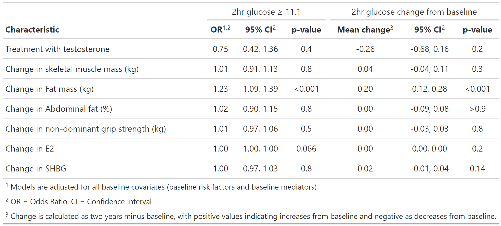

```{r setup, include=TRUE}
knitr::opts_chunk$set(
  echo = TRUE,
  comment = "#>",
  out.width = "100%")

## read in packages

library(knitr)
library(officedown)
library(officer)
library(gtsummary)
library(flextable)
library(tidyverse)
library(janitor)
library(haven)
library(labelled)
library(glue)
library(cowplot)
library(medflex)

## dataset of all variables used in paper
df<-readRDS("mediationdf.rds")


#knit(input="mediation_paper.rmd", output = "readme.md") 
```
# T4DM mediation analyses

This is the code that performs the analyses in the paper published here (insert link when known). 


# T4DM data structure

## Outcomes at two years

- categorical outcome of diabetes `ogtt_gt11` (`1`=diabetes, `0`=no diabetes) 
- continuous outcome of change in 2hour glucose by OGTT `change_ogtt` (year 2 minus baseline)

## Baseline covariates

As included in adjusted analysis in original paper ([Wittert et al 2021](https://doi.org/10.1016/S2213-8587(20)30367-3)):

- `ogtt_base`: 2hour glucose at baseline
- `siteid`: study site
- `waist_gp`: waist circumference stratification variable (`1`=95–100 cm, `2`=101–115 cm, `3`>115 cm )
- `age_ge60`: age stratification variable, age greater than or equal to 60 (`1`=yes, `0`=no)
- `dm_hist`: first-degree family history of type 2 diabetes (`1`=yes, `0`=no)
- `ssri_base`: SSRI use at baseline (`1`=yes, `0`=no)
- `t_gp`: grouped as `1`= Low (<8.0 nmol/L), `2`=Medium (8.0 to <11.0 nmol/L), `3`= High (>=11.0 nmol/L)
- `smoker`: current smoker (`1`=yes, `0`=no)

plus 

- `treatment`: with testosterone `1`=Testosterone, `0`=placebo

## Baseline mediators

- `bmleanms_base`: baseline lean mass
- `bmfatms_base`: baseline fat mass
- `bmapfm_base`: baseline abdominal fat percentage
- `grip_base`: baseline grip strength
- `e2_base`: baseline E2
- `shbg_base`: baseline SHBG

## Mediators

- `leanmass_change`: change in lean mass
- `fatmass_change`: change in fat mass
- `abdomfat_change`: change in abdominal fat percentage
- `grip_change`: change in grip strength
- `e2_change`: change in E2
- `shbg_change`: change in SHBG

So, the dataset looks like so, using the first 2 patients as an example:

```{r}
df %>%
  glimpse()
```

# Figure 2: unadjusted and adjusted analyses

```{r}

unadj.or<- glm(ogtt_gt11 ~treatment, data=df,
             family = binomial(link="logit")) %>%
  tbl_regression(exponentiate = TRUE, show_single_row="treatment") 

# run each of the categorical models
adj.risk.or <-glm(ogtt_gt11 ~ogtt_base+treatment+ 
                    siteid+ waist_gp+  age_ge60+dm_hist+ ssri_base+t_gp+smoker,
                  data=df,
                  family = binomial(link="logit"), 
                  control=list(maxit=10000)) %>%
  tbl_regression(exponentiate = TRUE,show_single_row="treatment",
                 include = c("treatment"))


adj.allbase.or <-glm(ogtt_gt11 ~ogtt_base+treatment+ 
                       #baseline mediators
                       bmleanms_base+ 
                       bmfatms_base+ 
                       bmapfm_base+  
                       grip_base+ e2_base+shbg_base+ 
                       siteid+ waist_gp+  age_ge60+dm_hist+ ssri_base+t_gp+smoker,
                     data=df,
                     family = binomial(link="logit")) %>%
  tbl_regression(exponentiate = TRUE,
                 show_single_row="treatment",
                 include = c("treatment"))

adj.full.or <-glm(ogtt_gt11 ~ogtt_base+treatment+ 
                    #baseline + change covariates
                    bmleanms_base+leanmass_change+ 
                    bmfatms_base+ fatmass_change+
                    bmapfm_base+ abdomfat_change+ 
                    grip_base+ grip_change+
                    e2_base+e2_change+
                    shbg_base+ shbg_change+
                    siteid+ waist_gp+  age_ge60+dm_hist+ ssri_base+t_gp+smoker,
                  data=df,
                  family = binomial(link="logit")) %>%
  tbl_regression(exponentiate = TRUE,
                 show_single_row="treatment",
                 include = c("treatment"))

# stick them together 
models.a<-tbl_stack(list(unadj.or, 
                         adj.risk.or, 
                         adj.allbase.or,
                         adj.full.or))

# plot A
models.a$table_body %>%
  mutate(name = case_when(tbl_id1==1 ~ "Unadjusted", 
                          tbl_id1==2 ~ "Adjusted for baseline risk factors" , 
                          tbl_id1==3 ~ "Adjusted for all baseline covariates*" ,
                          tbl_id1==4 ~ "Mediation adjusted") %>%
           as.factor()) %>%
  ggplot(aes(y=fct_reorder(name, -tbl_id1), x=estimate)) +
  geom_point(size=3)+
  geom_errorbar(aes(xmax=conf.high, xmin=conf.low), size=0.5, width=0.1) +
  labs(x="Odds ratio (95% CI)", y="")+
  geom_vline(aes(xintercept= 1), linetype="dotted")+
  coord_trans(x = scales:::log_trans(base = exp(1))) +
  theme_minimal() -> plot.a

# run each of the continuous models
unadj.lm<- glm(change_ogtt ~treatment, data=df) %>%
  tbl_regression(show_single_row="treatment") 

adj.risk.lm <-glm(change_ogtt ~ogtt_base+treatment+ 
                    siteid+ waist_gp+  age_ge60+dm_hist+ ssri_base+t_gp+smoker,
                  data=df) %>%
  tbl_regression(show_single_row="treatment",
                 include = c("treatment"))


adj.allbase.lm <-glm(change_ogtt ~ogtt_base+treatment+ 
                       bmleanms_base+ 
                       bmfatms_base+ 
                       bmapfm_base+  
                       grip_base+ e2_base+shbg_base+ 
                       siteid+ waist_gp+  age_ge60+dm_hist+ ssri_base+t_gp+smoker,
                     data=df) %>%
  tbl_regression(show_single_row="treatment",
                 include = c("treatment"))


adj.full.lm <-glm(change_ogtt ~ogtt_base+treatment+ 
                    bmleanms_base+leanmass_change+  
                    bmfatms_base+ fatmass_change+
                    bmapfm_base+  abdomfat_change+ e2_base+e2_change+shbg_base+ shbg_change+
                    grip_base+ grip_change+
                    siteid+ waist_gp+  age_ge60+dm_hist+ ssri_base+t_gp+smoker,
                  data=df) %>%
  tbl_regression(show_single_row="treatment",
                 include = c("treatment"))

# stick them together

models.b<-tbl_stack(list(unadj.lm, 
                         adj.risk.lm, 
                         adj.allbase.lm,
                         adj.full.lm))

# plot B
models.b$table_body %>%
  mutate(name = case_when(tbl_id1==1 ~ "Unadjusted", 
                          tbl_id1==2 ~ "Adjusted for baseline risk factors" , 
                          tbl_id1==3 ~ "Adjusted for all baseline covariates*" ,
                          tbl_id1==4 ~ "Mediation adjusted") %>%
           as.factor()) %>%
  ggplot(aes(y=fct_reorder(name, -tbl_id1), x=estimate)) +
  geom_point(size=3)+
  geom_errorbar(aes(xmax=conf.high, xmin=conf.low), size=0.5, width=0.1) +
  labs(x="Change in OGTT (95% CI)", y="")+
  theme(axis.ticks.y = element_blank())+
  geom_vline(aes(xintercept= 0), linetype="dotted") +
  theme_minimal()+
  scale_y_discrete(labels=c("Unadjusted" = "",
                            "Adjusted for baseline risk factors" = "",
                            "Adjusted for all baseline covariates*"="",
                            "Mediation adjusted"="")) -> plot.b

# stick the two plots together
plot_grid(plot.a, plot.b, 
          labels="AUTO", 
          label_x = c(0.4,0),
          rel_widths = c(1.1,0.6))
```


# Mediation analyses

Performed using `medflex` package:

 Johan Steen, Tom Loeys, Beatrijs Moerkerke, Stijn Vansteelandt (2017). medflex: An R
  Package for Flexible Mediation Analysis using Natural Effect Models. Journal of
  Statistical Software, 76(11), 1-46. doi:10.18637/jss.v076.i11

For the underlying methods please cite the following papers:

  Lange, T., Vansteelandt, S., & Bekaert, M. (2012). A Simple Unified Approach for
  Estimating Natural Direct and Indirect Effects. American Journal of Epidemiology,
  176(3), 190-195.

  Vansteelandt, S., Bekaert, M., & Lange, T. (2012). Imputation Strategies for the
  Estimation of Natural Direct and Indirect Effects. Epidemiologic Methods, 1(1),
  Article 7.

  Loeys, T., Moerkerke, B., De Smet, O., Buysse, A., Steen, J., & Vansteelandt, S.
  (2013). Flexible Mediation Analysis in the Presence of Nonlinear Relations: Beyond the
  Mediation Formula. Multivariate Behavioral Research, 48(6), 871-894.


## Continuous outcome

```{r}
# continuous outcome model
expData<-neImpute(change_ogtt  ~ factor(treat)+
                    #mediators
                    fatmass_change+leanmass_change+  
                    abdomfat_change+ grip_change+e2_change+ shbg_change+
                    #adjustments
                    ogtt_base+ 
                    bmleanms_base+ bmfatms_base  + 
                    bmapfm_base+  grip_base+ e2_base+shbg_base+ 
                    siteid+ waist_gp+  age_ge60+dm_hist+ ssri_base+t_gp+smoker,
                  nMed = 6,
                  data=df)

neMod.extra.cont<-neModel(change_ogtt ~ treat0+treat1+
                            ogtt_base+ 
                            bmleanms_base + bmfatms_base+  
                            bmapfm_base+ grip_base+ e2_base+shbg_base+ 
                            siteid+ waist_gp+  age_ge60+dm_hist+ ssri_base+t_gp+smoker, 
                          family = gaussian(link = "identity"),
                          se="robust",
                          expData=expData)

cont.extra<-data.frame(est = neMod.extra.cont$neModelFit$coefficients, confint(neMod.extra.cont))

lht <- neLht(neMod.extra.cont, linfct = c("treat01 = 0", 
                                          "treat11  = 0", 
                                          "treat01 + treat11  = 0"))

t<-summary(lht)

cont.extra<-data.frame(est = t$coefficients[,1], confint(lht))

#pte.direct.cont<-(t$coefficients[1,1]/t$coefficients[3,1])*100
pte.indirect.cont<-(t$coefficients[2,1]/t$coefficients[3,1])*100

```


## Categorical outcome

```{r}
#catgeorical outcome model
expData2<-neImpute(ogtt_gt11 ~factor(treat)+
                     #mediators
                     fatmass_change+leanmass_change+  
                     abdomfat_change+ grip_change+e2_change+ shbg_change+ 
                     #adjustments
                     ogtt_base+ 
                     bmleanms_base+ bmfatms_base  + 
                     bmapfm_base+  grip_base+ e2_base+shbg_base+ 
                     siteid+ waist_gp+  age_ge60+dm_hist+ ssri_base+t_gp+smoker,
                   family = binomial(link="logit"),
                   nMed = 6,
                   data=df)

neMod.extra.cat<-neModel(ogtt_gt11 ~ treat0+treat1+
                           ogtt_base+
                           bmleanms_base + bmfatms_base+  
                           bmapfm_base+  grip_base+ e2_base+shbg_base+ 
                           siteid+ waist_gp+  age_ge60+dm_hist+ ssri_base+t_gp+smoker,
                         family = binomial(link = "logit"),
                         control=list(maxit=10000),
                         se="robust",
                         expData=expData2)

cat.extra<-data.frame(OR = exp(neMod.extra.cat$neModelFit$coefficients),
                      exp(confint(neMod.extra.cat)))

lht <- neLht(neMod.extra.cat, linfct = c("treat01 = 0", 
                                         "treat11  = 0", 
                                         "treat01 + treat11  = 0"))

t<-summary(lht)

cat.extra<-data.frame(est = exp(t$coefficients[,1]), exp(confint(lht)))

#pte.direct.cat<-(t$coefficients[1,1]/t$coefficients[3,1])*100
pte.indirect.cat<-(t$coefficients[2,1]/t$coefficients[3,1])*100
```

## Figure 3

```{r}

#using the mediation models run up above in the results chunk
cat.extra %>%
  mutate(name = c("Direct effect", "Indirect effect", "Total effect")) %>%
  ggplot(aes(y=fct_rev(name), x=est)) +
  geom_point(size=3)+
  geom_errorbar(aes(xmax=X95..UCL, xmin=X95..LCL), size=0.5, width=0.1) +
  labs(x="Odds ratio (95% CI)", y="")+
  geom_vline(aes(xintercept= 1), linetype="dotted")+
  coord_trans(x = scales:::log_trans(base = exp(1))) +
  theme_minimal() -> plot.a2

cont.extra %>%
  mutate(name = c("Direct effect", "Indirect effect", "Total effect")) %>%
  ggplot(aes(y=fct_rev(name), x=est)) +
  geom_point(size=3)+
  geom_errorbar(aes(xmax=X95..UCL, xmin=X95..LCL), size=0.5, width=0.1) +
  labs(x="Change in OGTT (95% CI)", y="")+
  theme(axis.ticks.y = element_blank())+
  geom_vline(aes(xintercept= 0), linetype="dotted") +
  theme_minimal()+
  scale_y_discrete(labels=c("Direct effect" = "",
                            "Indirect effect" = "",
                            "Total effect"=""))  -> plot.b2

# stick together
plot_grid(plot.a2, plot.b2, 
          labels="AUTO", 
          label_x = c(0.2,0.05),
          rel_widths = c(1.1,0.8))
```

# Table 1:  Treatment mediation: estimates of effects from models of 2-hour glucose ≥ 11.1mmol/L and change in OGTT at two years

```{r, include=FALSE}

allcat <- glm(ogtt_gt11 ~ogtt_base+treatment+ 
                bmleanms_base+leanmass_change+ 
                bmfatms_base+ fatmass_change+
                bmapfm_base+ abdomfat_change+ 
                grip_base+ grip_change+
                e2_base+e2_change+shbg_base+ shbg_change+
                siteid+ waist_gp+  age_ge60+dm_hist+ ssri_base+t_gp+smoker,
              data=df,
              family = binomial(link="logit")) %>%
  tbl_regression(exponentiate = TRUE,
                 show_single_row="treatment", 
                 include = c("treatment", contains("change"))) 

allcont<-glm(change_ogtt ~ogtt_base+treatment+ 
               bmleanms_base+leanmass_change+ 
               bmfatms_base+ fatmass_change+
               bmapfm_base+ abdomfat_change+ 
               grip_base+ grip_change+
               e2_base+e2_change+shbg_base+ shbg_change+
               siteid+ waist_gp+  age_ge60+dm_hist+ ssri_base+t_gp+smoker, 
             data=df) %>%
  tbl_regression(show_single_row="treatment", 
                 include = c(treatment, contains("change"))) 

table1<-tbl_merge(list(allcat, allcont), 
          tab_spanner = c("2hr glucose \U2265 11.1", "2hr glucose change from baseline"))  %>%
  modify_header(estimate_2 = "**Mean change**") %>%
  modify_footnote(c(estimate_1, estimate_2) ~ 
                    "Models are adjusted for all baseline covariates (baseline risk factors and baseline mediators)") %>%
  modify_footnote(c(estimate_2) ~ 
                    "Change is calculated as two years minus baseline, with positive values indicating increases from baseline and negative as decreases from baseline. ")
```

```{r, include=FALSE}
# Had to manually save images, not sure if better way.
gt::gtsave(as_gt(table1), file = "figure/README-tbl1.png")
```
```{r out.width = "25%", echo = FALSE}

```
